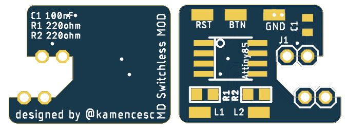

# UNTESTED
Note: After programming the Attiny, the RST pin is used as a in/out pin, so you need to make (or buy) a High Voltage Programmer to fuse-reset as you can see there: (https://sites.google.com/site/wayneholder/attiny-fuse-reset)

# MD Switchless MOD ATtiny
Sega Mega Drive/Genesis Switchless mod with an ATtiny85

Similar to the Switchless Mod code for Sega Saturn (https://github.com/sebknzl/saturnmod), this code is writed from zero and works this way:

- It change between 3 regions, 1 = PAL (Default at first time that the code runs and you can change it if you wish), 2 = USA, 3 = JAPAN
- Short press of  the reset button does the region change (EU->USA->JAP->EU....)
- The region is saved to the internat EEPROM for the next boot
- Long press of the reset button (+2 seconds) does the reset

Code was typed in the Adrduino IDE, you can find the pins config on the source code.

There's an untested PCB desing for and easy installation, maybe it doesn't fit on all revision boards.

# RE programming
As you can see, RST pin is used as a IO pin, so you can't program the attiny85 again as usual.
You need to make a High Voltage fuse-reset as you can see there: (https://sites.google.com/site/wayneholder/attiny-fuse-reset)
